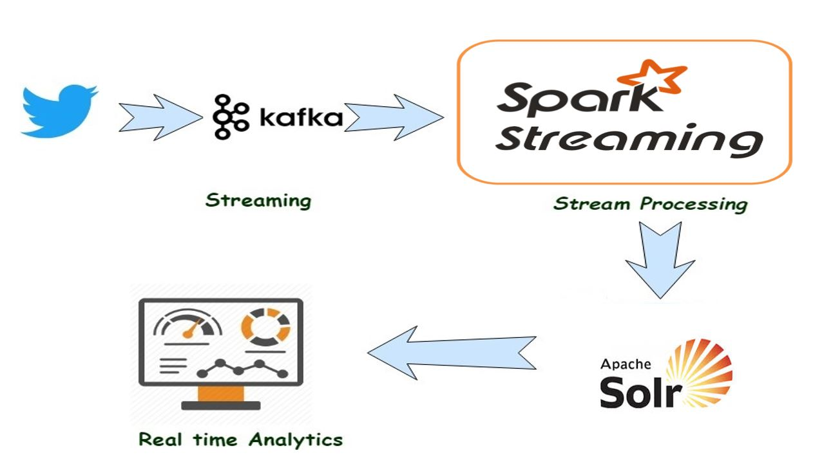

# Real Time Twitter Analysis using Spark Streaming, Kafka
## Introduction
Scalable and fault-tolerant data pipeline to collect Tweets that have hash tags #corona, #coronavirus, #covid19 and run analytics in real-time using Kafka, Spark Streaming and Apache Solr.

Kafka Producer - Python program that uses the "tweepy", "kafka-python" dependency to stream current tweets that have given hash tags and store in kafka.

Spark Streaming - Python program that reads data from kafka using Spark Streaming and then uses "pysolr" dependency to writes the data   to solr document.

Banana- Load tweets from Solr and display different charts like Top Countries, Map-Based tweets.

## Architecture


## Prerequisites
* Download the HDP 3.1 Sandbox from [here](http://hortonworks.com/products/hortonworks-sandbox/#install)
* Start the Sandbox in VMWare( It's your choice you can also Virtual Machine)
* If you have hadoop cluster already then you can ignore above 2 steps.(Install Solr, Kafka, Spark if not installed).
* Generate Twitter Access Token and add them in config.ini file
* Install required libraries:
```bash
$ pip install json pyspark tweepy==3.8.0 kafka-python==2.0.1 pysolr==3.8.1 configparser
```
* Create a solr collection using configset "geobasedConfig" file in repository:
```bash
bin/solr create -c "geoBasedTweets" -s 1  -d server/solr/configsets/geobasedConfig -n geoBasedTweets
```
* Download Banana and install it.
```
cd $SOLR_HOME/server/solr-webapp/webapp
sudo git clone https://github.com/lucidworks/banana
```

## Instructions

**Step 1:** Run GeoBasedStreamer.py file to stream tweets from Twitter and store them into Kafka.
```bash
python GeoBasedStreamer.py
```
**Step 2:** Submit spark application using jar "spark-streaming-kafka-0-8-assembly_2.11-2.3.1.jar" to process the tweets from kafka and write the processed tweets to solr.
```bash
PYSPARK_PYTHON=python3.6 spark-submit --master yarn --deploy-mode client --conf "spark.dynamicAllocation.enabled=false"  --jars spark-streaming-kafka-0-8-assembly_2.11-2.3.1.jar GeoBasedProcessor.py sandbox-hdp.hortonworks.com:2181 geoBasedTweets
```
**Step 3:** Load the "CoronaTweets_BananaUI" file in Banana UI and update collection name to "geoBasedTweets". Use the following URL to access the dashboard:
http://hostname:8886/solr/banana/src/index.html#/dashboard


## Dashboard


## References
1. [Tweepy(Twitter API)](http://docs.tweepy.org/en/latest/index.html)
2. [Kafka-Python](https://kafka-python.readthedocs.io/en/master/index.html)
3. [Spark Streaming](https://spark.apache.org/docs/latest/streaming-programming-guide.html)
3. [SQLAlchemy SOLR](https://github.com/aadel/sqlalchemy-solr)
4. [Banana](https://doc.lucidworks.com/lucidworks-hdpsearch/2.5/Guide-Banana.html)
5. [Python](https://docs.python.org/3/library/index.html)
